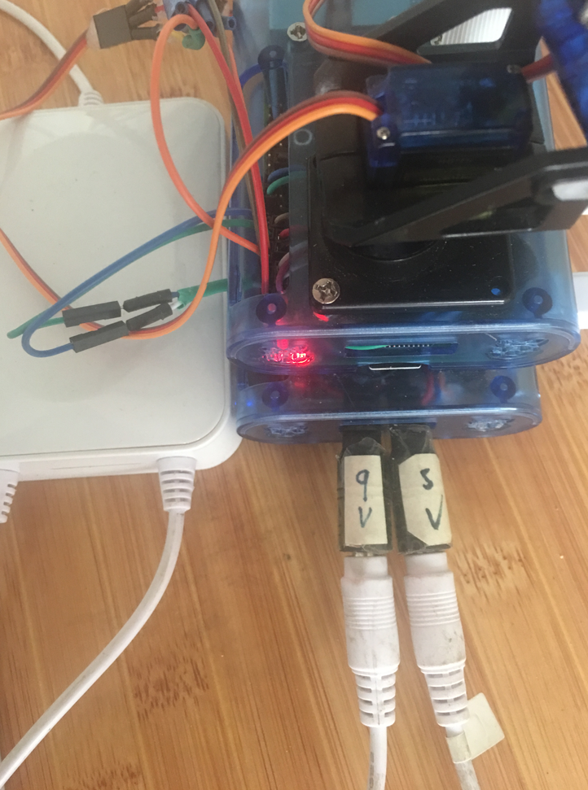

树莓派使用nodemcu做远程开关。更多说明见：https://maplesugar.gitlab.io 

1.原理

nodemcu连接两个继电器，控制树莓派电源和树莓派引脚的通断。
第一个继电器控制树莓派的一个GPIO信号。树莓派的这个GPIO拉高后，接地，平时是不通的，也就是GPIO一直是高电平。第一个继电器闭合后，树莓派的这个GPIO接地，变成低电平。树莓派通过检测这个GPIO变成低电平来执行shutdown命令关闭树莓派。等待二分钟后，保证树莓派已经关机，就控制第二个继电器关闭树莓派电源。

同时，由于树莓派不能读取ups剩余电量，就由nodemcu控制ups断电使用时间了。nodemcu检查网络断掉后，就认为已经断电，维持适当时间后，关闭树莓派。当来电后，nodemcu检查到网络联通后，就认为来电了，打开树莓派。

